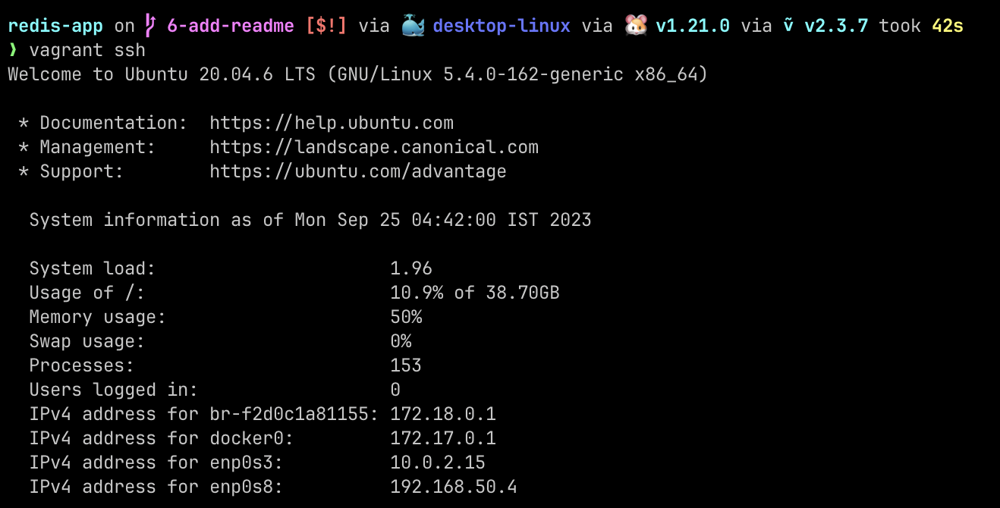
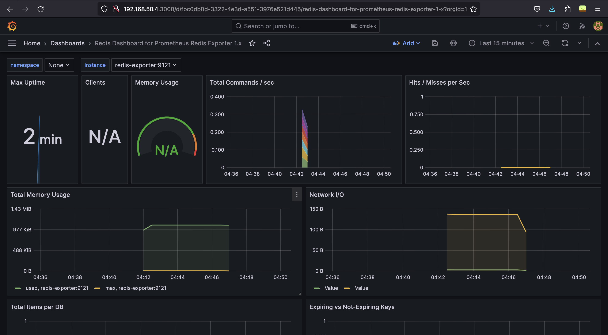
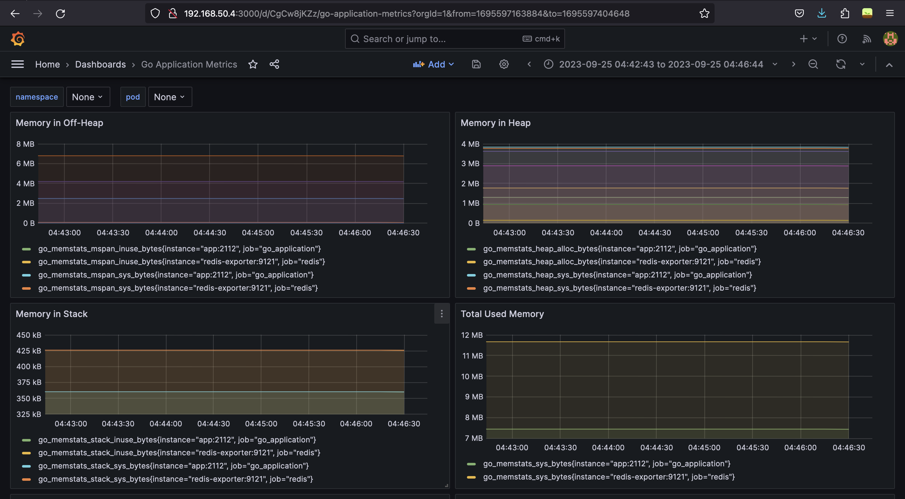

# Redis Application

Problem Statement

## Description

This is a sample `Go` application which connects to Redis. The app increments a Redis `counter` on an incoming request.

### Setting up the app

- Use `make build` to compile the binary.
- Set the environment variables:
  - `DEMO_APP_ADDR`: Address where the app should listen to
  - `DEMO_REDIS_ADDR`: Address where Redis is running

## Tasks

- Create a `Dockerfile` for the app.

- Create a `docker-compose.yml` for the app which includes the following:
  - `redis` service, with data directory mounted.
  - `app` service, ensuring that it has a dependency on the Redis service starting correctly.
  - `nginx` service acting as a reverse proxy for the app. Bonus: Implement SSL using self-signed certificates.

- Write a bash script to set up a [Vagrant box](https://vagrant.io) with Ubuntu. Ensure the script has error checks and is idempotent.

- Using Ansible provision the VM to:
  - Setup hostname of VM as `demo-ops`.
  - Create a user `demo`.
  - Harden the security:
    - Disable root login.
    - Setup a basic firewall (e.g., UFW) allowing only specific ports.
  - Configure `sysctl` for sane defaults. (For eg: increasing open files limit)
  - Configure sysctl for sane defaults. For each sysctl parameter changed:
    - Document the change.
    - Provide a brief justification or explanation (2-3 lines) detailing why this specific change was made and its implications.
  - Set the system's timezone to "Asia/Kolkata".
  - Install Docker and Docker-Compose.
  - Configure Docker Daemon to have sane defaults. For eg: keep logs size in check.
  - Deploy the `docker-compose.yml` in `/etc/demo-ops` and start the services.
  - Bonus: Install and configure monitoring tools like Prometheus and Grafana. Ensure app and redis metrics are being scraped.

- Commit the scripts to Github and share the link.

### Bonus Section

If you have extra time and experience working with Kubernetes or Nomad, you're welcome to attempt the following bonus scenarios. Remember, this section is optional and designed to explore advanced skills.

#### K8s

- Create a namespace `demo-ops`
- Create a deployment and service manifest for the app.
- Configure liveliness check, resource quotas for the deployment.

#### Nomad
  - Create a namespace `demo-ops`
  - Create a Job spec for the app. You can group both the services (`app` and `redis`) under the same job.
  - Run on a local Nomad dev agent.

## About the project

This is a project built around deploying and managing a Go application that interacts with Redis.The application increments the value of a key every time a request is made to it.
- It is deployed in a virtual machine through `docker-compose`.
- The virtual machine orchestration is done using `Vagrant`.
- The environment for deploying the application is created using `Ansible`.
- Prometheus and Grafana have been configured for monitoring the Go application
    and Redis.
- Have added kubernetes manifests as well for the application deployment on a
    Kubernetes based environment.

## Screenshots

### Vagrant Setup And Provisioning

**Vagrant Private Network**

Note that the static IP that we have provided is `192.168.50.4`

### Monitoring

**Redis grafana dashboard**

**Go application grafana dashboard**

