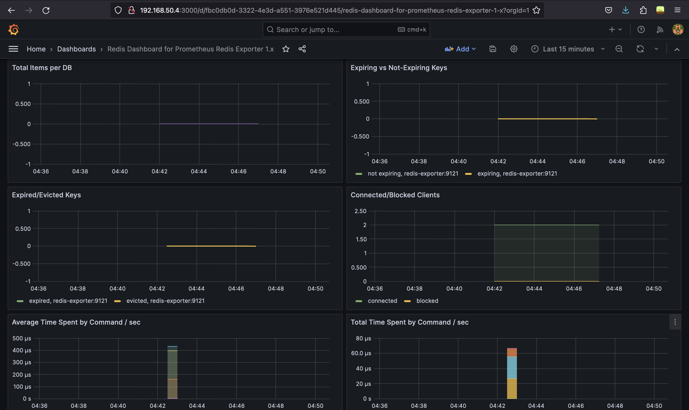

# Redis Application

## About the project

This is a project built around deploying and managing a Go application that interacts with Redis.The application increments the value of a key every time a request is made to it.
- It is deployed in a virtual machine through `docker-compose`.
- The virtual machine orchestration is done using `Vagrant`.
- The environment for deploying the application is created using `Ansible`.
- Prometheus and Grafana have been configured for monitoring the Go application
    and Redis.
- Have added kubernetes manifests as well for the application deployment on a
    Kubernetes based environment.

**Note**: Have committed the self-signed certificates since they won't cause any
damage and would help in verifying a task mentioned from the list of tasks in
problem statement.

## Screenshots

### Vagrant Setup And Provisioning

Link to the vagrant provisioning screencast: 

**Vagrant Private Network**

Note that the static IP that we have provided is `192.168.50.4`

### Monitoring

**Redis grafana dashboard**

**Go application grafana dashboard**

